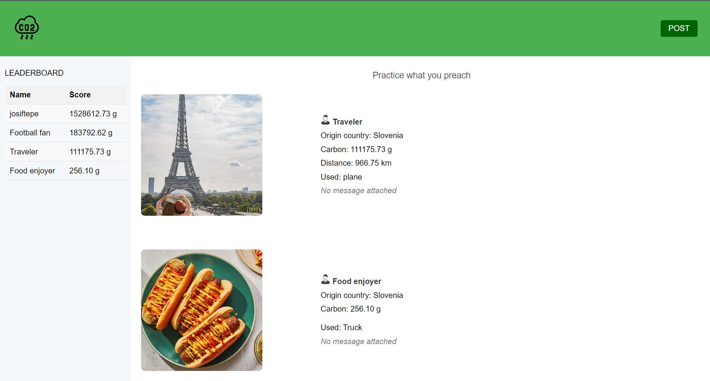
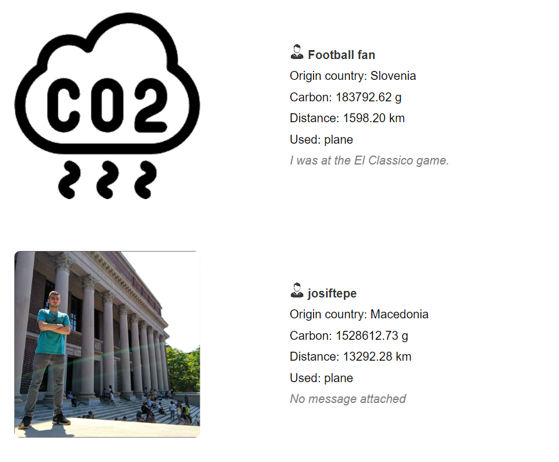

# CELEBRITY CO2 SHAMER :earth_africa:
## About
You know how Greta Thunberg is shamming us for excessive CO2 emissions for our daily needs! So why don't we change the sides and check their emissions, while they are preaching to us a eco awareness for the planet? That's exactly what Celebrity CO2 Shamer does. Using their pictures or text posts on social media where they promote their luxorius lifestyle,  calculates the amount of CO2 emission of their extravagant way of living. 

## Usage instruction


Move to server folder and install requirements.
```
pip install -r requirements.txt
```

Works on django sever which serves static pages.
```
python manage.py runserver
```

## Technology stack


# Results



